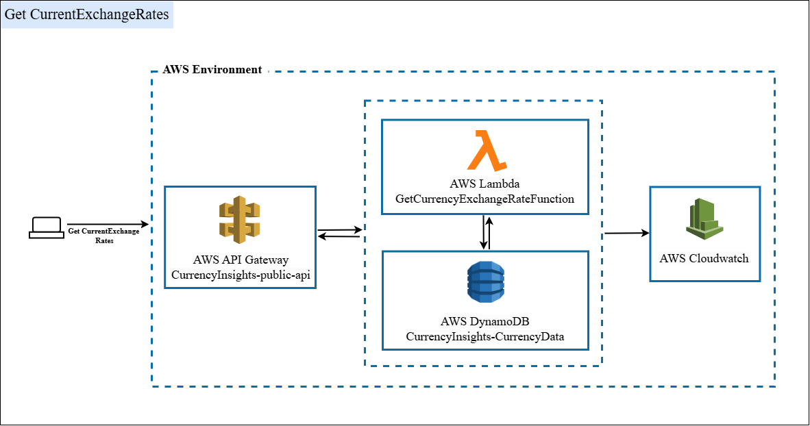
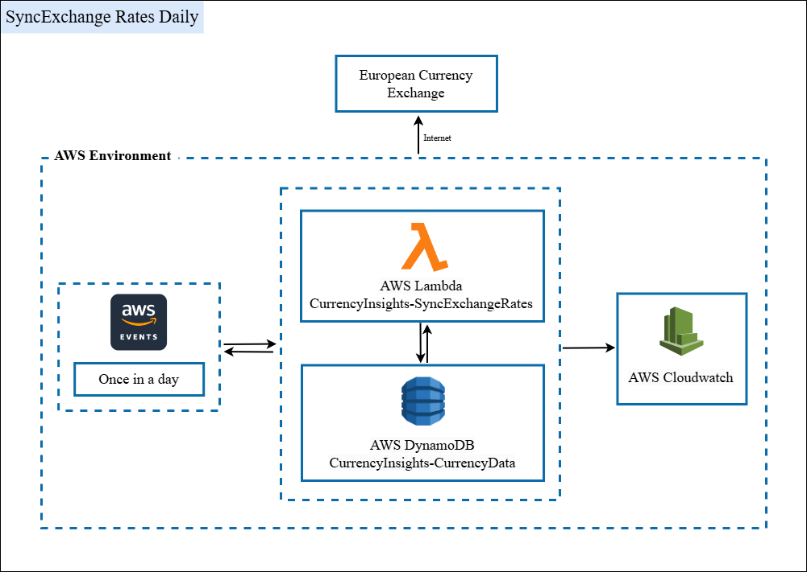
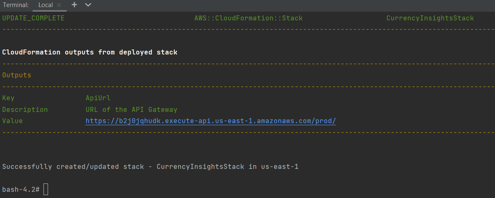
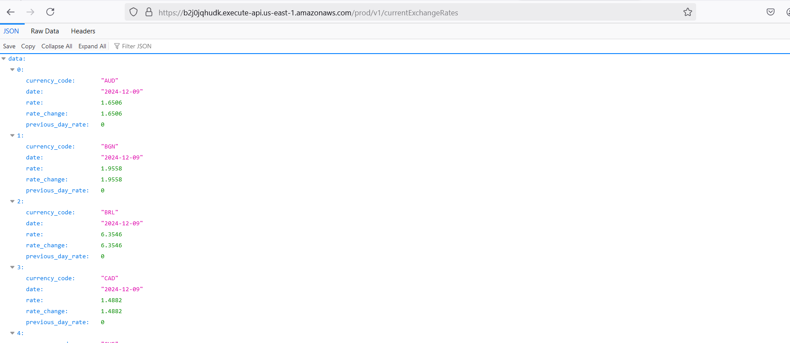

# CurrencyInsights

**Note**: I have also uploaded a video for Project Setup and System Demo [https://drive.google.com/file/d/1Rp4KCP4Lm3oD8N5KImtEHytexJ48LomU/view?usp=sharing]. Feel free to watch if you encounter any issues. For additional assistance, you can contact me at ramish534@outlook.com.


CurrencyInsights is a currency exchange tracking application built on AWS. It fetches real-time currency exchange rates from the European Central Bank and calculates changes over time, making it easy to track and analyze currency fluctuations. The project ensures scalability, reliability, and efficient deployment using AWS serverless solutions.

---

## 🏛 Architecture

This system utilizes AWS serverless components for efficient currency exchange data tracking and seamless integration.





## 💻 Technologies

- **AWS Lambda**: Processes data and manages application logic.
- **DynamoDB**: Stores currency exchange rates and historical data.
- **API Gateway**: Provides secure API endpoints for client interaction.
- **CloudFormation**: Automates infrastructure setup.
- **CloudWatch**: Monitors and logs system activity.
- **Docker**: Enables containerized deployment.

---

## 🚀 Getting Started

Follow these steps to set up and deploy **CurrencyInsights**.

---

## ✅ Prerequisites

Before you begin, ensure the following are installed and set up on your system:

- [Docker](https://www.docker.com/products/docker-desktop)
- AWS IAM account with **administrative rights**

---

## 🔧 Setup and Installation

### ➡️ Step 1: Clone the Repository

1. **Clone the repository**:
   
    ```bash
    git clone https://github.com/RamishUrRehman007/CurrencyInsights.git
    ```

2. **Navigate to the project directory**:
   
    ```bash
    cd CurrencyInsights
    ```

### ➡️ Step 2: Update Configuration

1. Open the `deploy-env.properties` file and add your AWS credentials:
    ```properties
    AWS_ACCESS_KEY_ID=<your-access-key-id>
    AWS_SECRET_ACCESS_KEY=<your-secret-access-key>
    AWS_DEFAULT_REGION=<your-region>
    ```

### ➡️ Step 3: Build and Deploy

#### For Linux and macOS:

```bash
docker build -t currencyinsightsdeployenv -f Docker.DeployEnv .
docker run -it -v $(pwd):/var/task --env-file ./deploy-env.properties currencyinsightsdeployenv bash
sam build --config-file ./prod-config.toml
sam deploy --config-file ./prod-config.toml
```

#### For Windows PS:

```bash
docker build -t currencyinsightsdeployenv -f Docker.DeployEnv .
docker run -it -v ${pwd}:/var/task --env-file ./deploy-env.properties currencyinsightsdeployenv bash
sam build --config-file ./prod-config.toml
sam deploy --config-file ./prod-config.toml
```

## 🌐 Accessing the Application

You will get the URL as an output in the terminal Or AWS Console Cloudformation Stack Output. 
Copy that, add the suffix "v1/currentExchangeRates", and access it in the browser. You will see the data because we are already invoking the SyncExchangeRates Lambda function during a fresh deployment. This ensures that the data is available in DynamoDB.

Example URL: "https://dup06m7qv7.execute-api.eu-west-2.amazonaws.com/prod/v1/currentExchangeRates"




